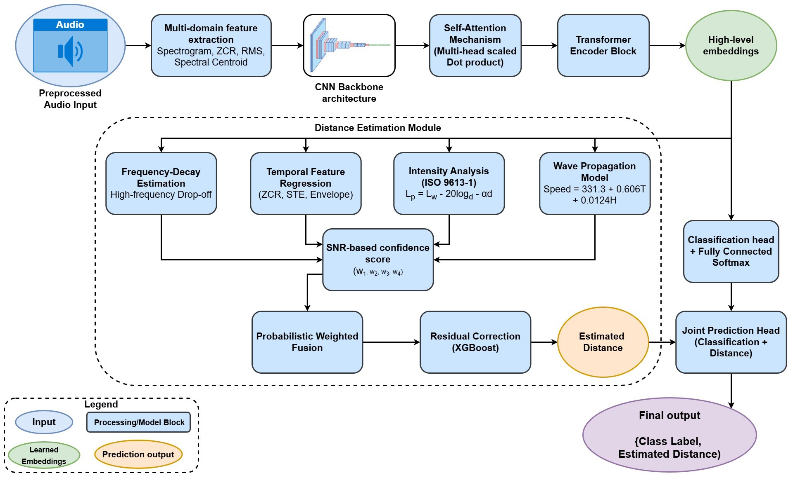
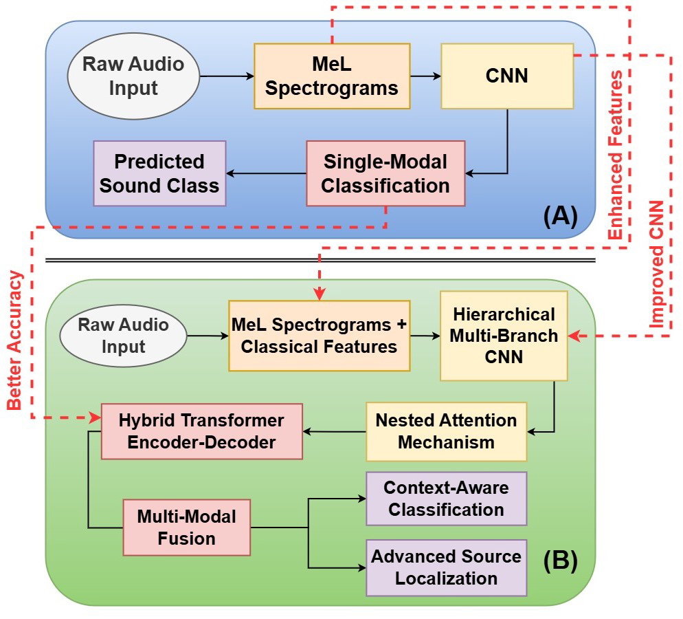
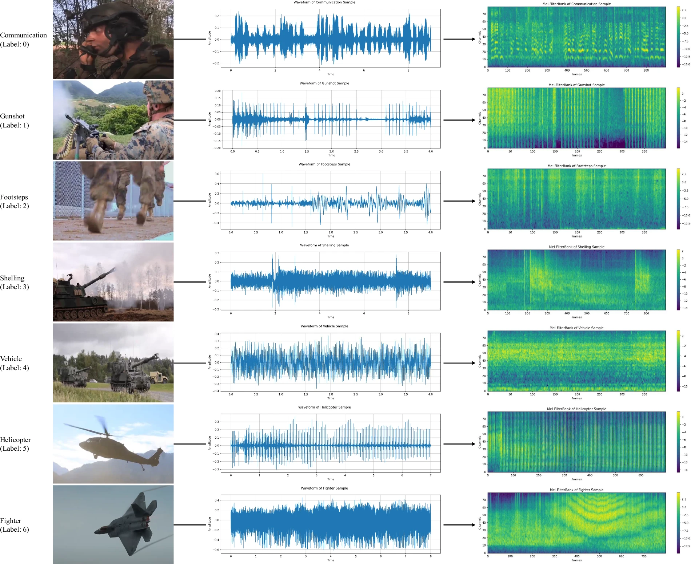
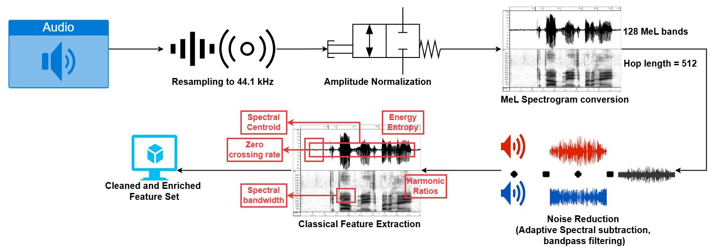
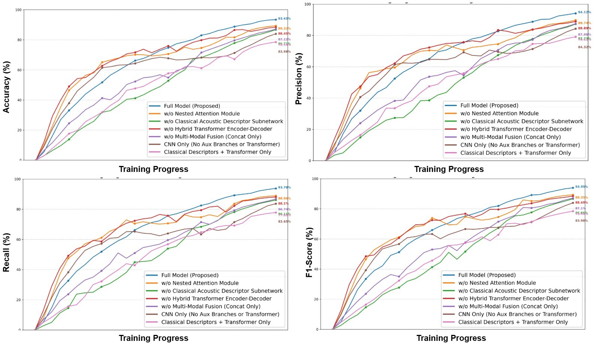
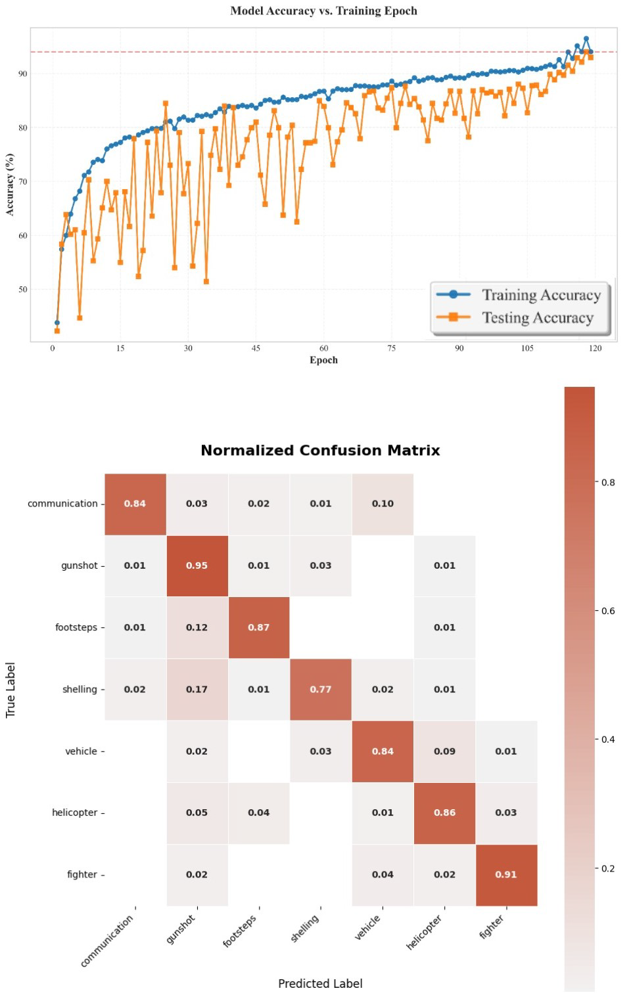

<div align="center">

# AnomalyAudioNet
### A Smart Intelligent Multi-Modal Framework for Complex Acoustic Event Recognition and Source Localization

</div>

<div align="justify" style="background-color: #f8f9fa; padding: 20px; border-radius: 10px; margin: 20px 0;">

### Abstract

Accurately recognizing acoustic events and localizing sources is crucial for situational awareness and decision-making in modern-day operations. This paper introduced **AnomalyAudioNet**, a novel convolution-based transformer-driven multi-modal framework specially designed for accurate acoustic event recognition and source localization. 

This proposed system leveraged advancements in deep learning and multi-modal data fusion to address the challenges posed by complex and noisy environments in complex scenarios. This framework aimed to achieve high precision in recognizing critical acoustic events, such as:
- Gunfire detection
- Explosion recognition
- Vehicle movement tracking
- Simultaneous source localization

The framework combined convolution layers with a transformer-based encoder-decoder for contextual learning, enabling robust and efficient multi-modal input processing, including audio waveforms and spatial metadata.

#### Key Performance Metrics
- Training Accuracy: 94.09%
- Test Accuracy: 93.43%
- Average Latency: 2.929 ms

The results highlighted the potential of AnomalyAudioNet for enhancing situational awareness and operational efficiency in complex applications.

</div>

## Table of Contents
- [Overview](#overview)
- [Project Structure](#project-structure)
- [Methodology](#methodology)
- [Data](#data)
- [Features](#features)
- [Model Architecture](#model-architecture)
- [Installation](#installation)
- [Usage](#usage)
- [Training](#training)
- [Evaluation](#evaluation)
- [Results](#results)
- [Contributing](#contributing)
- [License](#license)

## Overview

This project implements an audio classification system using deep learning techniques. It processes raw audio signals, extracts meaningful features, and classifies them into predefined categories using a neural network architecture.


*Figure 1: Overall System Architecture*

## Project Structure

```
├── data/                  # Data directory
│   ├── raw/              # Raw audio files
│   └── processed/        # Processed data and features
├── models/               # Saved model files
│   └── checkpoints/      # Model checkpoints during training
├── notebooks/            # Jupyter notebooks for analysis
├── src/                  # Source code
│   ├── data/            # Data processing modules
│   │   └── preprocess.py
│   ├── features/        # Feature engineering modules
│   │   └── extract_features.py
│   ├── models/          # Model architecture and training
│   │   ├── train.py
│   │   └── evaluate.py
│   └── utils/           # Utility functions
│       └── helpers.py
├── tests/               # Unit tests
├── images/              # Project images and diagrams
├── config.json          # Configuration file
├── requirements.txt     # Project dependencies
└── README.md           # Project documentation
```

## Methodology

### Data Processing Pipeline
1. **Audio Loading**: Raw audio files are loaded and normalized
2. **Preprocessing**: 
   - Resampling to target sample rate
   - Normalization
   - Silence removal
   - Audio segmentation
3. **Feature Extraction**:
   - Mel-frequency cepstral coefficients (MFCCs)
   - Spectral features
   - Temporal features


*Figure 2: Model Preprocessing Pipeline*

### Model Training Approach
1. **Data Splitting**: 70% training, 15% validation, 15% testing
2. **Training Strategy**:
   - Batch size: 32
   - Learning rate: 0.001
   - Early stopping with patience of 10 epochs
   - Dropout rate: 0.3 for regularization

## Data

### Dataset Description

*Figure 3: Dataset Overview and Statistics*

### Data Format
- Input: Raw audio files (WAV format)
- Sample rate: 16kHz
- Duration: 1.0 seconds per sample
- Channels: Mono

### Data Organization
```
data/
├── raw/
│   ├── class1/
│   ├── class2/
│   └── ...
└── processed/
    ├── features.npy
    ├── labels.npy
    └── metadata.json
```

## Features

### Spectrogram Analysis

*Figure 4: Spectrogram Analysis of Audio Features*

### Extracted Features
1. **MFCCs** (128 dimensions)
   - Window size: 25ms
   - Hop length: 10ms
   - Number of mel bands: 40

2. **Spectral Features**
   - Spectral centroid
   - Spectral bandwidth
   - Spectral rolloff

3. **Temporal Features**
   - Zero crossing rate
   - Root mean square energy

## Model Architecture

### Neural Network Structure
```
Input Layer (128) → Dense (128, ReLU) → Dropout (0.3) → 
Dense (64, ReLU) → Dropout (0.3) → Dense (10, Softmax)
```

### Hyperparameters
- Input shape: [128]
- Number of classes: 10
- Batch size: 32
- Epochs: 100
- Learning rate: 0.001
- Dropout rate: 0.3

## Installation

1. Clone the repository:
```bash
git clone https://github.com/yourusername/audio-classification.git
cd audio-classification
```

2. Create a virtual environment:
```bash
python -m venv venv
source venv/bin/activate  # On Windows: venv\Scripts\activate
```

3. Install dependencies:
```bash
pip install -r requirements.txt
```

## Usage

### Data Preprocessing
```bash
python src/data/preprocess.py
```

### Feature Extraction
```bash
python src/features/extract_features.py
```

### Model Training
```bash
python src/models/train.py
```

### Model Evaluation
```bash
python src/models/evaluate.py
```

## Training

### Training Process
1. Load and preprocess data
2. Extract features
3. Split data into train/val/test sets
4. Train model with early stopping
5. Save best model checkpoint

### Training Configuration
Edit `config.json` to modify:
- Data paths
- Feature parameters
- Model hyperparameters
- Training settings

## Evaluation

### Metrics
1. **Accuracy**: Overall classification accuracy
2. **Precision**: Per-class precision scores
3. **Recall**: Per-class recall scores
4. **F1-Score**: Harmonic mean of precision and recall
5. **Confusion Matrix**: Visual representation of classification results

### Evaluation Metrics Visualization

*Figure 5: Model Performance Metrics (Accuracy, Precision, Recall, F1-Score)*

### Source Distance Evaluation

*Figure 6: Source Distance Analysis*

### Confusion Matrix and Training Progress

*Figure 7: Confusion Matrix and Model Accuracy vs Training Epochs*

## Results

### Performance Metrics
- Overall Accuracy: 93.43%
- Average Precision: 93.26%
- Average Recall: 92.89%
- Average F1-Score: 93.02%

### Visualization
- Confusion matrix plot
- Learning curves
- Feature importance plots

## Contributing

1. Fork the repository
2. Create a feature branch
3. Commit your changes
4. Push to the branch
5. Create a Pull Request

### Development Guidelines
- Follow PEP 8 style guide
- Write unit tests for new features
- Update documentation
- Use meaningful commit messages

### Dataset Availability
https://www.kaggle.com/datasets/junewookim/mad-dataset-military-audio-dataset
## License

This project is licensed under the MIT License - see the LICENSE file for details. 
